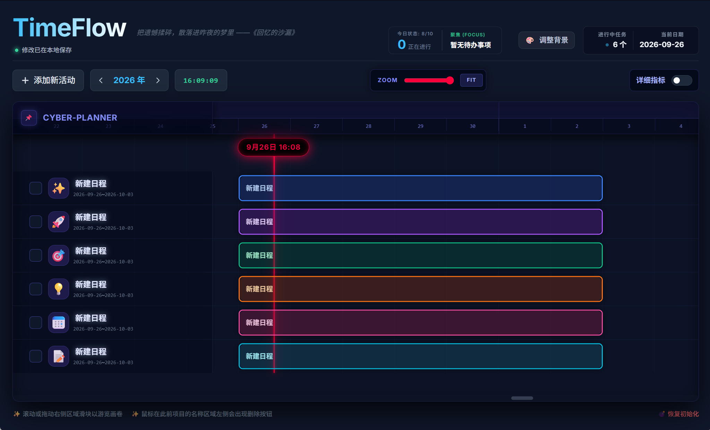

# ⏳ TimeFlow (实时电子时间规划图)

一个高颜值、极客风的纯前端交互式甘特图与个人时间规划工具 (Interactive Timeline Planner)。无需复杂的后端配置，开箱即用，所有数据安全保存在本地。

## ✨ 核心特性 (Features)

- **🚀 零构建 (Zero-Build)**：只需双击 `index.html` 即可在任何现代浏览器中运行，完全本地化。
- **💾 无感本地存储**：数据（任务、里程碑、颜色偏好、全局缩放等）实时自动保存至浏览器 LocalStorage，刷新不丢失。
- **🎨 极客风 UI 与极致个性化**：
  - 深度定制的暗黑模式，配合毛玻璃 (Glassmorphism) 特效与发光阴影。
  - 内置多种精美渐变主题色（如海王星、翡翠星云、紫晶幻境），支持系统取色器或外部图片链接自定义背景。
  - 任务条支持自定义颜色标记与专属 Emoji。
  - 所有文字、日期均支持即点即改（Inline Editing）。
- **⏱️ 动态时间游标与全局缩放**：
  - 拥有高亮的“今日状态”动态游标（Scrubber），顶部仪表盘会实时计算当前“正在进行”的任务并聚焦。
  - 底层网格支持自由的全局无极缩放 (Zoom 滑块)，并拥有一键 `Fit` 自适应屏幕视野的功能。
- **🚩 里程碑 (Milestones) 节点跟踪**：可以在任意任务的生命周期中插入带有日期的里程碑节点（开启"详细指标"后添加），鼠标悬浮可查看和修改具体内容。

## 📖 详细操作指南 (User Guide)

### 1. 基础启动
由于采用 **零构建 (Zero-Build)** 方案，无需繁琐的环境配置：
1. `git clone https://github.com/Nu0TXer/TimeFlow.git` 或下载源文件。
2. 双击打开 `index.html` 即可在现代浏览器中直接运行。

### 2. 📝 任务与日程管理
- **添加活动**：点击顶部的 `添加新活动` 按钮，系统会插入一条默认周期为 7 天的日程。
- **行内编辑**：直接点击左侧列表中的 **任务标题**、**开始时间**、**结束时间** 即可进入编辑模式（修改后鼠标失焦或按回车自动保存）。
- **任务状态**：点击标题左侧的勾选框标记“完成/未完成”。已完成的任务会自动变灰并置底。鼠标悬浮在行最左侧边缘，会浮现红色的“删除”按钮。

### 3. 🎨 界面与样式定制
- **定制任务条**：点击左侧任务项专属的 **大图标**（如 🚀 或 ✨），在弹出的面板中可自由切换 12 种高对比度颜色和多种 Emoji 图标。
- **定制全局背景**：点击右上角 `🎨 调整背景`：
  - 支持一键切换预设的宇宙/极客风渐变背景。
  - 支持唤出系统取色器选取自定义纯色。
  - 支持直接粘贴网络图片 URL 作为背景（系统会自动附加深色毛玻璃遮罩以保证文本可读性）。
- **个性签名标题**：点击左上角的 `TimeFlow` 大标题可以自由修改系统名称，下方也会伴随有随机的极客风语录轮播。

### 4. 🔍 视图与甘特图控制
- **自由缩放**：拖拽右上角的 **Zoom 滑块**，调整甘特图时间轴的精细度（宏观可以总览按月分布，微观可以精确看清每一天）。
- **全局适配**：点击 `Fit` 按钮，系统会根据当前所有任务的时间跨度，智能缩放并居中当前视野，一眼看清项目全貌。
- **年份导航**：点击顶部 `[<] 2026年 [>]` 切换器，甘特图视图会自动平滑滚动到目标年份。
- **交互式游标**：用鼠标在甘特图上方区域拖拽高亮的“动态游标滑块”，可以快速查看每一天的对应日期，且左上角面板会实时算出被游标命中的核心任务。

### 5. 🚩 进度条与里程碑 (Milestones)
- **开启详细指标**：打开顶部右上角的 `详细指标` 切换开关，左侧任务列表会全部展开，展示进度面板。
- **进度调节**：通过拖拉展开面板里的滑块调整进度 (0-100%)，甘特图上的发光任务条会自动同步填充对应比例。
- **管理里程碑**：在详细指标面板中，点击 `添加节点 (Milestone)`。此时对应任务条上会出现一个圆形节点标记。鼠标悬停在节点上即可修改该里程碑的标题和具体日期，或者将其删除。

### 6. 💣 数据管理
- **无感存取**：所有修改（连同你的界面背景、缩放比例）都会静默保存在浏览器的 LocalStorage 中，刷新网页绝不丢失数据。
- **恢复出厂设置**：如需彻底重置数据从头开始，点击页面最右下角的 `💣 恢复初始化` 清空所有缓存并刷新网页。

## 🛠️ 技术栈 (Tech Stack)

本项目采用超轻量级的原生前端方案构建，完全摆脱 Node.js 依赖和冗长的 Webpack/Vite 打包流程：
- **React 18** (通过 UMD CDN 引入)
- **Babel Standalone** (用于浏览器内实时编译 JSX 语法)
- **Tailwind CSS** (通过脚本 CDN 引入，开启暗黑模式和全局内联主题配置)

## 📄 许可证 (License)

本项目遵循 [MIT License](./LICENSE) 开源协议。
